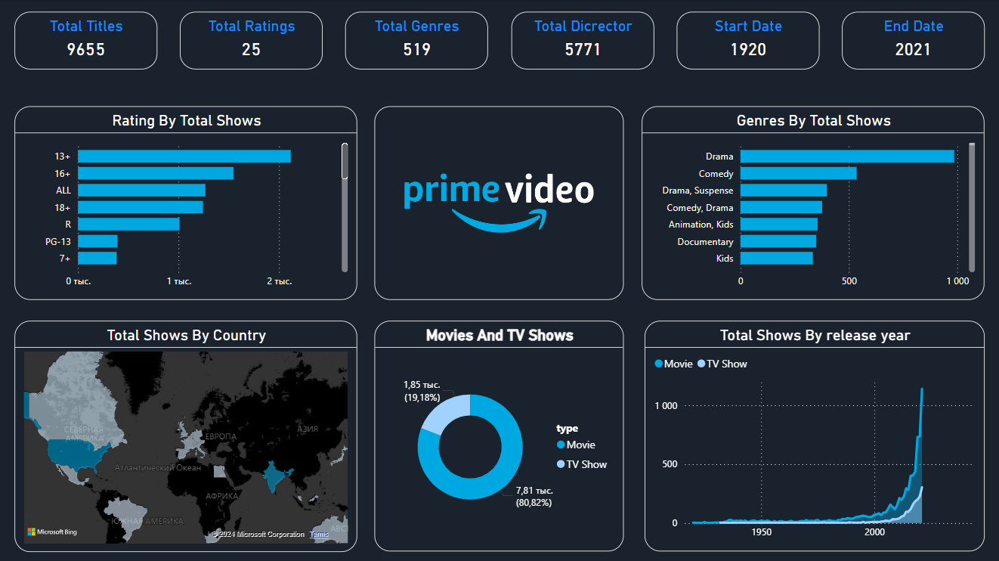

# Проект анализа данных - Amazon Prime Movies and TV Shows (Power BI)
Провела всесторонний анализ данных по более чем 9 000 фильмам и сериалам, доступным на Amazon Prime. Создала интерактивные дашборды в Power BI для визуализации распределения контента, популярности жанров, рейтингов IMDb и тенденций по годам выпуска. Предоставила ценные инсайты о контенте платформы и предпочтениях пользователей.

